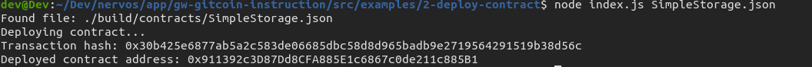

# Gitcoin 2) Deploy A Simple Ethereum Smart Contract On Polyjuice

Description : https://gitcoin.co/issue/nervosnetwork/grants/3/100026209

## Screenshot of the console output immediately after smart contract is successfully deployed.



## Transaction Hash

```
0x30b425e6877ab5a2c583de06685dbc58d8d965badb9e2719564291519b38d56c
```

## Deployed Contract Address

```
0x911392c3D87Dd8CFA885E1c6867c0de211c885B1
```
