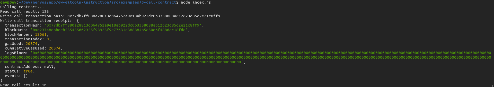

# Issue A Smart Contract Call To The Deployed Smart Contract

Description : https://gitcoin.co/issue/nervosnetwork/grants/4/100026210

## Screenshot of the console output immediately after smart contract call is issued.



## Transaction Hash

```
0x77db7ff880a28813d064752a9e18ab922dc0b3338088a612623d85d2e21c8ff9
```

## Contract Address

```
0x911392c3D87Dd8CFA885E1c6867c0de211c885B1
```

## Contract ABI

```
[
		    {
		      "inputs": [],
		      "stateMutability": "payable",
		      "type": "constructor"
		    },
		    {
		      "inputs": [
		        {
		          "internalType": "uint256",
		          "name": "x",
		          "type": "uint256"
		        }
		      ],
		      "name": "set",
		      "outputs": [],
		      "stateMutability": "payable",
		      "type": "function"
		    },
		    {
		      "inputs": [],
		      "name": "get",
		      "outputs": [
		        {
		          "internalType": "uint256",
		          "name": "",
		          "type": "uint256"
		        }
		      ],
		      "stateMutability": "view",
		      "type": "function"
		    }
]
```

