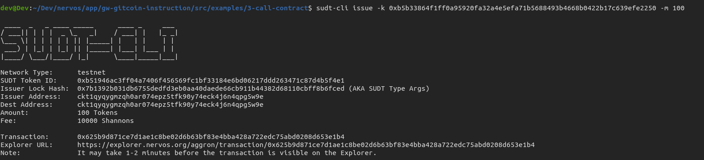
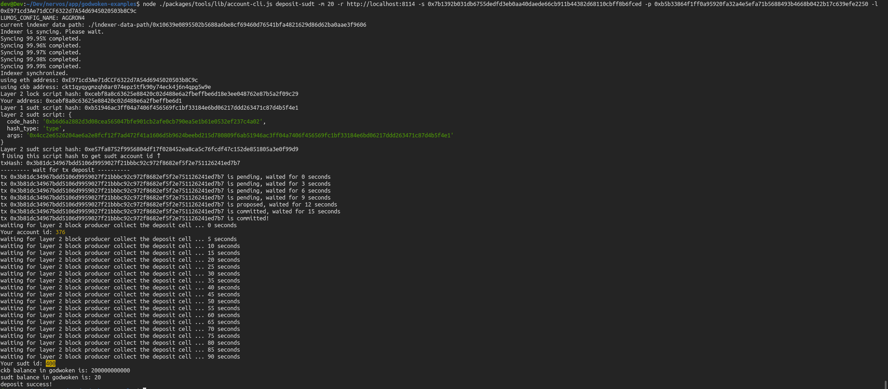

# Issue An SUDT Token On Layer 1 And Deposit It To Layer 2

Description : https://gitcoin.co/issue/nervosnetwork/grants/5/100026211

## A link to the Layer 1 address funded on Testnet Explorer

https://explorer.nervos.org/aggron/address/ckt1qyqygmzqh0ar074epz5tfk90y74eck4j6n4qpg5w9e


## Screenshot of the console output immediately after using sudt-cli to create your SUDT tokens on Layer 1.




## Link to the transaction ID created by sudt-cli on the Testnet Explorer.

https://explorer.nervos.org/aggron/transaction/0x625b9d871ce7d1ae1c8be02d6b63bf83e4bba428a722edc75abd0208d653e1b4

## Screenshot of the console output immediately after you have successfully submitted a deposit to Layer 2 using the account-cli tool




## SUDT ID

```
400
```
