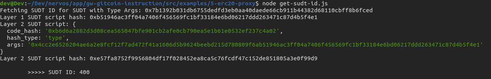

# Deploy The ERC20 Proxy Contract For The Deposited SUDT

Description : https://gitcoin.co/issue/nervosnetwork/grants/6/100026212

## Screenshot after deploying Contract


## Address of the deployed

```
0xAC49784A024733c63d5c12810DF2c942525C0742
```

## Screenshot of the console output immediately after checking SUDT balance


## Ethereum Address

```
0xE971cd3Ae71dCCF6322d7A54d6945020503b8C9c
```

## Layer 1 Issuer Lock Hash

```
0x7b1392b031db6755dedfd3eb0aa40daede66cb911b44382d68110cbff8b6fced
```

## Screenshot of the console output immediately after fetching SUDT ID




