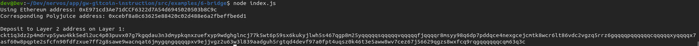

# Use Force Bridge To Deposit Tokens From Ethereum To Polyjuice

Description : https://gitcoin.co/issue/nervosnetwork/grants/7/100026213


## A screenshot of the console output immediately after deposit receiver address is successfully generated.




## Your Deposit Receiver Address (in text format).

```
ckt1q3dz2p4mdrvp5ywu4kk5edl2uc4p03puvx07g7kgqdau3n3dmypkqnxzuefxyp9wdghglncj77k5wt6p59sx6kukyjlwh5s467qgp8m25yqqqqqsqqqqqvqqqqqfjqqqqr8msyy98q6dp7pddqce4nexgcejcmtk8wcr6lt86vdc2vgzq5rrz6gqqqqpqqqqqqcqqqqqxyqqqqx7asf60w8pqpte2sfcfn90fdfzxue7ff2g8sawe9wacnqat6jmygqngqqqqpxv9ejjvgz2u63w3l839aadguh5rgtqd4devf97a0fpt4uqsz0k46t3e5aww8wv7cez67j56629qgzs8wxfcq9rqgqqqqqqcqm63q3c
```

## The Ethereum address used to generate the Deposit Receiver Address (in text format).

```

```

## A link to the Etherscan explorer for the successful Force Bridge transaction. This can be found on Force Bridge under History→Succeed.

```

```


## A link to the Nervos explorer for the successful Force bridge transaction. This can be found on Force Bridge under History→Succeed.

```

```


